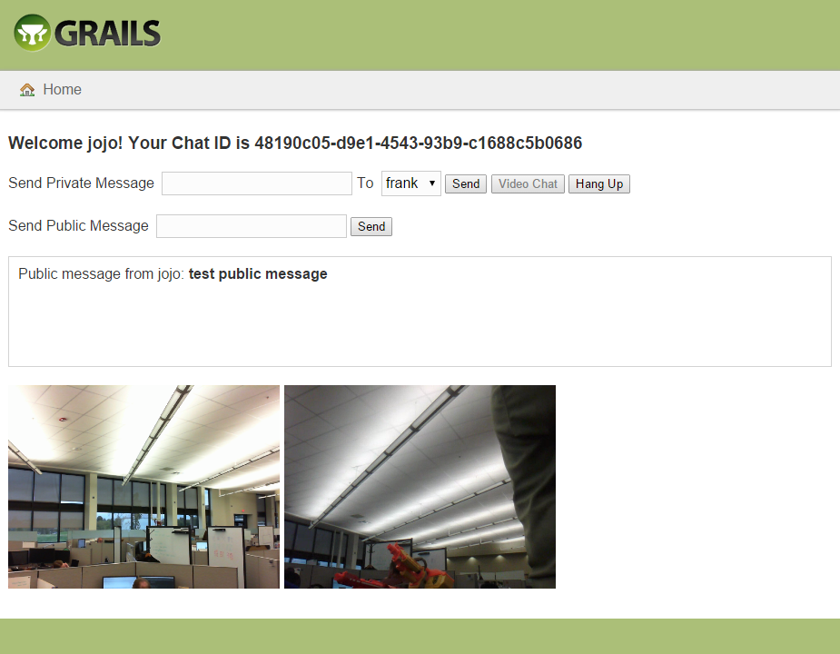

Grails Websocket Chat Example
=============================
What you have before you is an sample Grails chat application built with the
[Spring Websocket Plugin](http://grails.org/plugin/spring-websocket).  This
app supports broadcasting public messages as well as sending private messages
directly to other chat participants.  Rudimentary WebRTC video chat between
two participants is also supported. Server side message brokering is handled 
by an annotated Grails service while the client side UI is a GSP built with 
[SockJS](https://github.com/sockjs) and 
[stomp.js](http://jmesnil.net/stomp-websocket/doc/).  The Atmosphere plugin
was *not* used in the making of this application.

Disclaimer
----------
This app is a proof of concept only and is not intended to be a deployable, 
production application in any way, shape or form.

Requirements
------------
Grails 2.4.3

Usage
-----
Simply run **grails run-app** or, better yet, **grails run-app -https** and
navigate the the resulting URL.

Screenshot
----------
